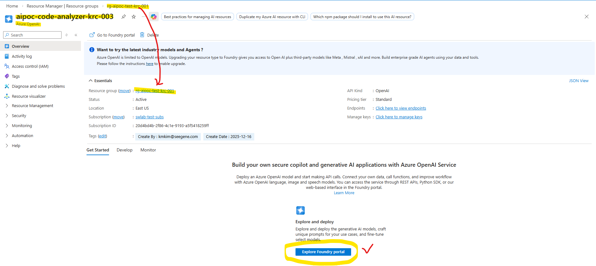
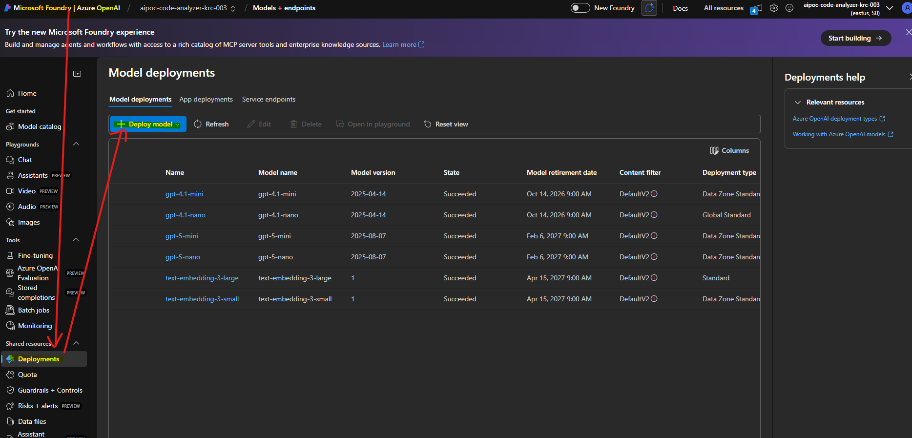
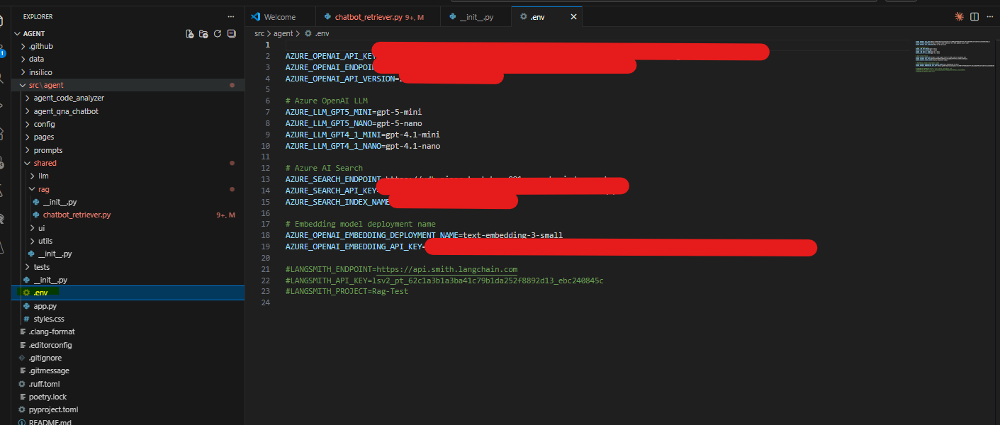

## Azure OpenAI Embeddings란?  

* Azure OpenAI Embeddings는 텍스트를 고차원 벡터로 변환하는 서비스  
* RAG 시스템에서 문서를 숫자 벡터로 표현하여 의미 기반 검색을 가능하게 한다.  
* [알고리즘 세부 원리는 블로그의 NLP 카테고리를 참조한다.](C:\Users\kmkim\Desktop\projects\blog\docs\blog\posts\Deep_Learning\NLP\1.nlp_overview.qmd)

**RAG 파이프라인에서의 역할:**  
- 문서 청크 → 벡터 변환  
- 사용자 질의 → 벡터 변환  
- 벡터 간 유사도 계산 → 관련 문서 검색  

**왜 임베딩이 필요한가?**  
- 키워드 매칭의 한계 극복 (예: "자동차" vs "승용차")  
- 의미적 유사성 계산 (코사인 유사도)  
- 다국어 지원 (동일 의미 공간에 매핑)  

## Azure OpenAI Embeddings 모델  

Azure OpenAI는 3가지 주요 임베딩 모델을 제공한다:  

### text-embedding-ada-002 (레거시)  

* **출시**: 2022년 12월  
* **사양:**  
    - 차원: 1536 (고정)  
    - 최대 토큰: 8,191  
    - 가격: $0.11 / 1M 토큰  
* **특징:**  
    - 범용 임베딩 모델  
    - 안정적이고 검증된 성능  
    - 신규 프로젝트는 text-embedding-3 권장  

### text-embedding-3-small (권장)  

* **출시**: 2024년 1월  
* **사양:**  
    - 차원: 512 또는 1536 (선택 가능)  
    - 최대 토큰: 8,191  
    - 가격: $0.022 / 1M 토큰 (ada-002 대비 **5배 저렴**)  
* **특징:**  
    - 성능은 ada-002와 유사  
    - **비용 효율적** (가격 1/5)  
    - 빠른 처리 속도  
* **RAG 시스템 권장**: **대부분의 경우 최선의 선택**  

### text-embedding-3-large (고성능)  

* **출시**: 2024년 1월  
* **사양:**  
    - 차원: 256 ~ 3072 (선택 가능)  
    - 최대 토큰: 8,191  
    - 가격: $0.143 / 1M 토큰  
* **특징:**  
    - **최고 성능** (MTEB 벤치마크 1위권)  
    - 다국어 지원 강화  
    - 복잡한 도메인에 적합  
* **RAG 시스템 권장**: 높은 정확도가 중요한 경우  

### 모델 비교  

| 항목 | ada-002 | text-embedding-3-small | text-embedding-3-large |  
|------|---------|------------------------|------------------------|  
| **차원** | 1536 | 512/1536 | 256~3072 |  
| **가격** | $0.10/1M | $0.022/1M | $0.143/1M |  
| **성능** | 기준 | 유사 | **최고** |  
| **속도** | 보통 | **빠름** | 보통 |  
| **권장** | 레거시 | ✅ 범용 | 고정밀도 필요 시 |  

## Azure OpenAI 리소스 생성  

* Azure Portal > Azure Open AI 검색

### Azure OpenAI 리소스 만들기:

- [portal.azure.com](https://portal.azure.com) → "리소스 만들기"  
- "Azure OpenAI" 검색 및 선택  
- **신청 양식 작성 필요** (처음 사용 시) 
- 그냥 안내사항에 따라 쉽게 만들 수 있음 

### 기본 설정

- **구독**: 사용할 구독 선택  
- **리소스 그룹**
  - 이름은 재량껏 안헷갈리게 작명  
  - `[Resource Group]-[Project name]-[Region]-[번호]` (예,`rg-rag-prod-eastus-001`)  
- **지역**: East US (GPT-4 지원) 또는 Sweden Central  
  - ⚠️ **Korea Central은 현재 일부 모델 미지원**  
- **이름**: 
  - 이름은 재량껏 안헷갈리게 작명
  - `[DB이름]-[Project name]-[Region]-[번호]` (예,`vdb-rag-prod-eastus-001`)  
- **가격 책정 계층**: Standard S0  

### 네트워킹:

- Resource Group과 동일한 가상 네트워크 선택
- Resource Group에서 생성하면 자동 생성됨  

### 검토 + 만들기 

- 생성 완료 (끝)   

## 모델 배포  

* Azure OpenAI 리소스 생성 후 **모델을 배포**해야 한다.  
* 본인의 Resource Group에서 Azure OpenAI 리소스 선택
* 또는 이름을 알면 검색해서 찾아도 됨
* Azure OpenAI 리소스를 선택하면 하단에 **Explore Foundry Portal** 버튼이 있음




### Azure OpenAI Studio 접속 

* 클릭하면 Azure OpenAI Studio로 이동

### 배포 만들기

- 왼쪽 사이드바 메뉴에서 Shared Resources → Deployments(배포) 클릭
- "배포" 메뉴 → "+ Deploy Model (배포 만들기) 버튼 클릭"  
- **모델 선택**: text-embedding-3-small  
- **Deployment Name**: `text-embedding-3-small` (또는 원하는 이름)  
- **Deployment Type**
    - Standard (latency 그럭저럭 쓸만할 정도)
    - Global Low Latency (더 빠름, 비용 더 높음)
    - Data Standard Zone    
- **모델 버전**: 최신 버전  
- **TPM (분당 토큰)**: 120K (기본값)  



### 엔드포인트 및 키 확인:

- 리소스 → "키 및 엔드포인트"  
- **KEY 1**, **엔드포인트** 복사  

### Azure CLI로 생성 (선택 사항)  

```bash  
# Azure OpenAI 리소스 생성  
az cognitiveservices account create \  
    --name openai-rag-prod \  
    --resource-group rg-rag-prod \  
    --kind OpenAI \  
    --sku S0 \  
    --location eastus \  
    --yes  

# 키 및 엔드포인트 조회  
az cognitiveservices account keys list \  
    --name openai-rag-prod \  
    --resource-group rg-rag-prod  

az cognitiveservices account show \  
    --name openai-rag-prod \  
    --resource-group rg-rag-prod \  
    --query properties.endpoint  
```  

## 환경 설정  

### Python SDK 설치  

```bash  
pip install openai  
pip install langchain-openai  
pip install python-dotenv  
pip install tiktoken  # 토큰 계산용  
```  

### 환경 변수 설정  

`.env` 파일:  
```  
AZURE_OPENAI_ENDPOINT=https://openai-rag-prod.openai.azure.com/  
AZURE_OPENAI_API_KEY=your-key-here  
AZURE_OPENAI_EMBEDDING_DEPLOYMENT=text-embedding-3-small  
AZURE_OPENAI_API_VERSION=2024-02-01  
```  



## 기본 사용법  

### 단일 텍스트 임베딩  

```{python}  
from openai import AzureOpenAI  
from dotenv import load_dotenv  
import os  

load_dotenv()  

# Azure OpenAI 클라이언트 생성  
client = AzureOpenAI(  
    api_key=os.getenv("AZURE_OPENAI_API_KEY"),  
    api_version=os.getenv("AZURE_OPENAI_API_VERSION"),  
    azure_endpoint=os.getenv("AZURE_OPENAI_ENDPOINT")  
)  

# 텍스트 임베딩 생성  
text = "Azure OpenAI는 Microsoft의 관리형 OpenAI 서비스다."  
response = client.embeddings.create(  
    input=text,  
    model=os.getenv("AZURE_OPENAI_EMBEDDING_DEPLOYMENT")  
)  

# 임베딩 벡터 추출  
embedding = response.data[0].embedding  

print(f"임베딩 차원: {len(embedding)}")  
print(f"첫 10개 값: {embedding[:10]}")  
```  

### 배치 임베딩 생성  

```{python}  
# 여러 텍스트 동시 임베딩  
texts = [  
    "Azure는 Microsoft의 클라우드 플랫폼이다.",  
    "RAG는 검색 증강 생성 기술이다.",  
    "임베딩은 텍스트를 벡터로 변환한다."  
]  

response = client.embeddings.create(  
    input=texts,  
    model=os.getenv("AZURE_OPENAI_EMBEDDING_DEPLOYMENT")  
)  

# 모든 임베딩 추출  
embeddings = [data.embedding for data in response.data]  

print(f"생성된 임베딩 수: {len(embeddings)}")  
print(f"각 임베딩 차원: {len(embeddings[0])}")  
```  

## LangChain 통합  

### AzureOpenAIEmbeddings 사용  

```{python}  
from langchain_openai import AzureOpenAIEmbeddings  

# LangChain 임베딩 클래스 생성  
embeddings = AzureOpenAIEmbeddings(  
    azure_deployment=os.getenv("AZURE_OPENAI_EMBEDDING_DEPLOYMENT"),  
    openai_api_version=os.getenv("AZURE_OPENAI_API_VERSION"),  
    azure_endpoint=os.getenv("AZURE_OPENAI_ENDPOINT"),  
    api_key=os.getenv("AZURE_OPENAI_API_KEY")  
)  

# 단일 텍스트 임베딩  
text = "LangChain은 LLM 애플리케이션 프레임워크다."  
embedding = embeddings.embed_query(text)  

print(f"임베딩 차원: {len(embedding)}")  
print(f"첫 5개 값: {embedding[:5]}")  
```  

### 문서 목록 임베딩  

```{python}  
from langchain_core.documents import Document  

# 문서 목록 생성  
documents = [  
    Document(page_content="Azure AI Search는 벡터 데이터베이스다.", metadata={"source": "doc1"}),  
    Document(page_content="Document Intelligence는 OCR 서비스다.", metadata={"source": "doc2"}),  
    Document(page_content="Blob Storage는 파일 저장소다.", metadata={"source": "doc3"})  
]  

# 문서 텍스트만 추출하여 임베딩  
texts = [doc.page_content for doc in documents]  
doc_embeddings = embeddings.embed_documents(texts)  

print(f"임베딩된 문서 수: {len(doc_embeddings)}")  
print(f"첫 번째 문서 임베딩 차원: {len(doc_embeddings[0])}")  
```  

## 문서 청크 임베딩  

RAG 시스템에서는 문서를 청크로 분할한 후 각 청크를 임베딩한다.  

### 전체 파이프라인  

```{python}  
from langchain.text_splitter import RecursiveCharacterTextSplitter  
from langchain_community.document_loaders import TextLoader  

# 1. 문서 로딩  
loader = TextLoader("sample_document.txt", encoding="utf-8")  
documents = loader.load()  

# 2. 텍스트 분할  
text_splitter = RecursiveCharacterTextSplitter(  
    chunk_size=1000,  
    chunk_overlap=200,  
    length_function=len,  
    separators=["\n\n", "\n", " ", ""]  
)  
chunks = text_splitter.split_documents(documents)  

print(f"생성된 청크 수: {len(chunks)}")  

# 3. 각 청크 임베딩  
chunk_texts = [chunk.page_content for chunk in chunks]  
chunk_embeddings = embeddings.embed_documents(chunk_texts)  

print(f"임베딩 완료: {len(chunk_embeddings)}개 청크")  
```  

### 메타데이터와 함께 저장  

```{python}  
# 임베딩과 메타데이터를 함께 저장  
embedded_chunks = []  
for chunk, embedding in zip(chunks, chunk_embeddings):  
    embedded_chunks.append({  
        "text": chunk.page_content,  
        "embedding": embedding,  
        "metadata": {  
            **chunk.metadata,  
            "chunk_size": len(chunk.page_content),  
            "embedding_model": "text-embedding-3-small"  
        }  
    })  

print(f"첫 번째 청크 메타데이터: {embedded_chunks[0]['metadata']}")  
```  

## 유사도 계산  

### 코사인 유사도  

```{python}  
import numpy as np  

def cosine_similarity(vec1, vec2):  
    """두 벡터 간 코사인 유사도 계산"""  
    return np.dot(vec1, vec2) / (np.linalg.norm(vec1) * np.linalg.norm(vec2))  

# 예시: 질의와 문서 유사도 계산  
query = "Azure의 AI 서비스는 무엇인가?"  
doc1 = "Azure AI Search는 검색 서비스다."  
doc2 = "Blob Storage는 파일 저장소다."  

# 임베딩 생성  
query_embedding = embeddings.embed_query(query)  
doc1_embedding = embeddings.embed_query(doc1)  
doc2_embedding = embeddings.embed_query(doc2)  

# 유사도 계산  
similarity1 = cosine_similarity(query_embedding, doc1_embedding)  
similarity2 = cosine_similarity(query_embedding, doc2_embedding)  

print(f"질의 vs 문서1 유사도: {similarity1:.4f}")  
print(f"질의 vs 문서2 유사도: {similarity2:.4f}")  
```  

### 가장 유사한 문서 찾기  

```{python}  
def find_most_similar(query_embedding, doc_embeddings, top_k=3):  
    """가장 유사한 문서 찾기"""  
    similarities = []  
    for idx, doc_emb in enumerate(doc_embeddings):  
        sim = cosine_similarity(query_embedding, doc_emb)  
        similarities.append((idx, sim))  
    
    # 유사도 높은 순으로 정렬  
    similarities.sort(key=lambda x: x[1], reverse=True)  
    return similarities[:top_k]  

# 사용 예시  
query = "RAG 시스템 구축 방법"  
query_emb = embeddings.embed_query(query)  

# 상위 3개 유사 문서 찾기  
top_docs = find_most_similar(query_emb, chunk_embeddings, top_k=3)  

print("가장 유사한 문서:")  
for idx, similarity in top_docs:  
    print(f"청크 {idx}: {similarity:.4f}")  
    print(f"내용: {chunks[idx].page_content[:100]}...\n")  
```  

## 차원 축소 (Matryoshka Embeddings)  

text-embedding-3 모델은 차원 축소를 지원한다.  

### 축소 차원으로 임베딩 생성  

```{python}  
# 512 차원으로 축소 (기본 1536)  
response = client.embeddings.create(  
    input="Azure OpenAI 임베딩 테스트",  
    model="text-embedding-3-small",  
    dimensions=512  # 1536 → 512  
)  

embedding_512 = response.data[0].embedding  
print(f"축소된 차원: {len(embedding_512)}")  
```  

### 차원 축소 후 유사도 비교  

```{python}  
# 전체 차원 (1536) vs 축소 차원 (512) 비교  
text1 = "Azure는 클라우드 플랫폼이다."  
text2 = "Microsoft의 클라우드 서비스다."  
text3 = "Python은 프로그래밍 언어다."  

# 1536 차원  
resp_full = client.embeddings.create(  
    input=[text1, text2, text3],  
    model="text-embedding-3-small"  
)  
emb_full = [d.embedding for d in resp_full.data]  

# 512 차원  
resp_reduced = client.embeddings.create(  
    input=[text1, text2, text3],  
    model="text-embedding-3-small",  
    dimensions=512  
)  
emb_reduced = [d.embedding for d in resp_reduced.data]  

# 유사도 비교  
sim_full_12 = cosine_similarity(emb_full[0], emb_full[1])  
sim_reduced_12 = cosine_similarity(emb_reduced[0], emb_reduced[1])  

print(f"1536 차원: text1-text2 유사도 = {sim_full_12:.4f}")  
print(f"512 차원: text1-text2 유사도 = {sim_reduced_12:.4f}")  
print(f"차이: {abs(sim_full_12 - sim_reduced_12):.4f}")  
```  

**차원 축소 장점:**  
- 저장 공간 절약 (512 차원: 1/3 크기)  
- 빠른 검색 속도  
- 유사도 정확도 약간 감소 (보통 5% 이내)  

## 배치 처리 최적화  

### 대량 문서 임베딩  

```{python}  
def embed_documents_batch(texts, batch_size=100):  
    """배치 단위로 대량 문서 임베딩"""  
    all_embeddings = []  
    
    for i in range(0, len(texts), batch_size):  
        batch = texts[i:i+batch_size]  
        print(f"배치 {i//batch_size + 1}/{(len(texts)-1)//batch_size + 1} 처리 중...")  
        
        # 배치 임베딩  
        batch_embeddings = embeddings.embed_documents(batch)  
        all_embeddings.extend(batch_embeddings)  
    
    return all_embeddings  

# 사용 예시 (1000개 문서)  
# large_texts = [f"문서 {i} 내용..." for i in range(1000)]  
# embeddings_result = embed_documents_batch(large_texts, batch_size=100)  
```  

### 병렬 처리  

```{python}  
from concurrent.futures import ThreadPoolExecutor  
import time  

def embed_chunk(texts_chunk):  
    """청크 단위 임베딩 (병렬 실행용)"""  
    return embeddings.embed_documents(texts_chunk)  

def embed_parallel(texts, num_workers=4, chunk_size=25):  
    """병렬로 임베딩 생성"""  
    # 청크로 분할  
    chunks = [texts[i:i+chunk_size] for i in range(0, len(texts), chunk_size)]  
    
    # 병렬 실행  
    start_time = time.time()  
    with ThreadPoolExecutor(max_workers=num_workers) as executor:  
        results = list(executor.map(embed_chunk, chunks))  
    
    # 결과 병합  
    all_embeddings = [emb for chunk_result in results for emb in chunk_result]  
    
    duration = time.time() - start_time  
    print(f"병렬 처리 완료: {len(all_embeddings)}개 임베딩, {duration:.2f}초")  
    
    return all_embeddings  

# 사용 예시  
# texts_sample = [f"샘플 텍스트 {i}" for i in range(100)]  
# parallel_embeddings = embed_parallel(texts_sample, num_workers=4, chunk_size=25)  
```  

## 캐싱 전략  

동일한 텍스트는 재계산하지 않도록 캐싱한다.  

### 간단한 캐싱  

```{python}  
import hashlib  
import json  

class EmbeddingCache:  
    def __init__(self, cache_file=".embedding_cache.json"):  
        self.cache_file = cache_file  
        self.cache = self._load_cache()  
    
    def _load_cache(self):  
        """캐시 파일 로드"""  
        try:  
            with open(self.cache_file, "r") as f:  
                return json.load(f)  
        except FileNotFoundError:  
            return {}  
    
    def _save_cache(self):  
        """캐시 파일 저장"""  
        with open(self.cache_file, "w") as f:  
            json.dump(self.cache, f)  
    
    def _get_hash(self, text):  
        """텍스트 해시 생성"""  
        return hashlib.md5(text.encode()).hexdigest()  
    
    def get_embedding(self, text, embeddings_func):  
        """캐시된 임베딩 반환 또는 생성"""  
        text_hash = self._get_hash(text)  
        
        # 캐시 확인  
        if text_hash in self.cache:  
            print(f"캐시 히트: {text[:50]}...")  
            return self.cache[text_hash]  
        
        # 임베딩 생성  
        print(f"캐시 미스: {text[:50]}...")  
        embedding = embeddings_func(text)  
        
        # 캐시 저장  
        self.cache[text_hash] = embedding  
        self._save_cache()  
        
        return embedding  

# 사용 예시  
cache = EmbeddingCache()  

text = "Azure OpenAI 서비스"  
emb1 = cache.get_embedding(text, embeddings.embed_query)  # 캐시 미스  
emb2 = cache.get_embedding(text, embeddings.embed_query)  # 캐시 히트 (즉시 반환)  
```  

### LangChain CacheBackedEmbeddings  

```{python}  
from langchain.embeddings import CacheBackedEmbeddings  
from langchain.storage import LocalFileStore  

# 로컬 파일 캐시 스토어  
store = LocalFileStore("./.embedding_cache/")  

# 캐시가 적용된 임베딩  
cached_embedder = CacheBackedEmbeddings.from_bytes_store(  
    underlying_embeddings=embeddings,  
    document_embedding_cache=store,  
    namespace="azure-openai-embeddings"  
)  

# 사용 (자동 캐싱)  
texts = ["Azure AI", "OpenAI Service", "Azure AI"]  # "Azure AI" 중복  
embeddings_result = cached_embedder.embed_documents(texts)  
# 두 번째 "Azure AI"는 캐시에서 즉시 반환  
```  

## 토큰 계산 및 비용 추정  

### 토큰 수 계산  

```{python}  
import tiktoken  

def count_tokens(text, model="cl100k_base"):  
    """텍스트의 토큰 수 계산"""  
    encoding = tiktoken.get_encoding(model)  
    return len(encoding.encode(text))  

# 예시  
text = "Azure OpenAI Embeddings는 텍스트를 벡터로 변환하는 서비스다."  
token_count = count_tokens(text)  

print(f"텍스트: {text}")  
print(f"토큰 수: {token_count}")  
```  

### 비용 추정  

```{python}  
def estimate_cost(token_count, model="text-embedding-3-small"):  
    """임베딩 비용 추정"""  
    prices = {  
        "text-embedding-ada-002": 0.0001,  # $0.10 / 1M tokens  
        "text-embedding-3-small": 0.00002,  # $0.02 / 1M tokens  
        "text-embedding-3-large": 0.00013   # $0.13 / 1M tokens  
    }  
    
    price_per_token = prices.get(model, 0)  
    cost = token_count * price_per_token  
    
    return cost  

# 예시: 10,000개 문서 (각 500 토큰)  
total_tokens = 10000 * 500  
cost_small = estimate_cost(total_tokens, "text-embedding-3-small")  
cost_large = estimate_cost(total_tokens, "text-embedding-3-large")  

print(f"총 토큰: {total_tokens:,}")  
print(f"text-embedding-3-small 비용: ${cost_small:.2f}")  
print(f"text-embedding-3-large 비용: ${cost_large:.2f}")  
```  

## Azure AI Search 연동  

임베딩 생성 후 Azure AI Search에 저장한다.  

```{python}  
from langchain_community.vectorstores.azuresearch import AzureSearch  

# Azure Search VectorStore 초기화  
vector_store = AzureSearch(  
    azure_search_endpoint=os.getenv("AZURE_SEARCH_ENDPOINT"),  
    azure_search_key=os.getenv("AZURE_SEARCH_API_KEY"),  
    index_name="rag-embeddings",  
    embedding_function=embeddings.embed_query  
)  

# 문서 추가 (자동 임베딩)  
from langchain_core.documents import Document  

documents = [  
    Document(page_content="Azure는 Microsoft의 클라우드 플랫폼이다.", metadata={"source": "doc1"}),  
    Document(page_content="RAG는 검색 증강 생성 기술이다.", metadata={"source": "doc2"}),  
    Document(page_content="임베딩은 텍스트를 벡터로 변환한다.", metadata={"source": "doc3"})  
]  

# 문서 추가 (임베딩 자동 생성 및 업로드)  
vector_store.add_documents(documents)  
print(f"{len(documents)}개 문서가 Azure AI Search에 추가되었다.")  
```  

## 모니터링  

### 임베딩 품질 확인  

```{python}  
def check_embedding_quality(embeddings_list):  
    """임베딩 품질 메트릭"""  
    if not embeddings_list:  
        return None  
    
    # 벡터 길이 (L2 norm)  
    norms = [np.linalg.norm(emb) for emb in embeddings_list]  
    
    # 차원별 통계  
    embeddings_array = np.array(embeddings_list)  
    
    metrics = {  
        "count": len(embeddings_list),  
        "dimensions": len(embeddings_list[0]),  
        "norm_mean": np.mean(norms),  
        "norm_std": np.std(norms),  
        "value_mean": np.mean(embeddings_array),  
        "value_std": np.std(embeddings_array)  
    }  
    
    return metrics  

# 사용 예시  
sample_texts = ["Azure", "OpenAI", "RAG", "Embeddings"]  
sample_embeddings = embeddings.embed_documents(sample_texts)  

quality = check_embedding_quality(sample_embeddings)  
print("임베딩 품질 메트릭:")  
for key, value in quality.items():  
    print(f"- {key}: {value}")  
```  

## 문제 해결  

### 일반적인 오류  

**1. RateLimitError: 요청 제한 초과**  
```python  
# 해결: 재시도 로직 구현  
from tenacity import retry, stop_after_attempt, wait_exponential  

@retry(stop=stop_after_attempt(3), wait=wait_exponential(multiplier=1, min=4, max=10))  
def embed_with_retry(text):  
    return embeddings.embed_query(text)  

# 사용  
result = embed_with_retry("테스트 텍스트")  
```  

**2. InvalidRequestError: 토큰 초과**  
```python  
# 해결: 텍스트 자르기 (최대 8,191 토큰)  
def truncate_text(text, max_tokens=8000):  
    encoding = tiktoken.get_encoding("cl100k_base")  
    tokens = encoding.encode(text)  
    
    if len(tokens) > max_tokens:  
        tokens = tokens[:max_tokens]  
        text = encoding.decode(tokens)  
    
    return text  

long_text = "..." * 10000  
safe_text = truncate_text(long_text)  
embedding = embeddings.embed_query(safe_text)  
```  

## 참고 자료  

### 공식 문서  
- [Azure OpenAI Embeddings](https://learn.microsoft.com/en-us/azure/ai-services/openai/concepts/understand-embeddings)  
- [text-embedding-3 모델](https://learn.microsoft.com/en-us/azure/ai-services/openai/concepts/models#embeddings-models)  
- [Python SDK 참조](https://learn.microsoft.com/en-us/python/api/overview/azure/openai-readme)  

### 벤치마크  
- [MTEB Leaderboard](https://huggingface.co/spaces/mteb/leaderboard) - 임베딩 모델 성능 비교  

## 다음 단계  

임베딩 생성이 완료되었다면, 이제 벡터 데이터베이스에 저장하자:  

👉 [04-Azure-AI-Search-Integration.qmd](./04-Azure-AI-Search-Integration.qmd) - Azure AI Search와 RAG 시스템 통합  