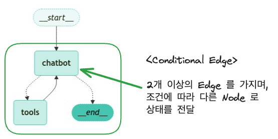
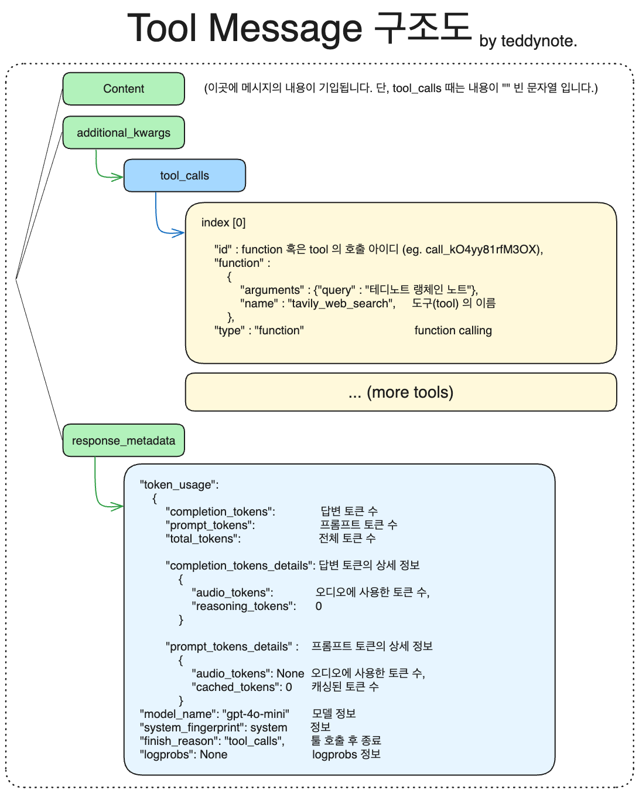

# LangGraph를 활용한 Agent 구축

* LangGraph는 agent와 함께 사용할 때 특히 강력한 기능을 발휘한다.   
* 웹 검색 도구를 통해 챗봇에 웹 검색 기능수행하는 Agent 을 추가한다.  
* LLM 에 도구를 바인딩하여 LLM 에 입력된 요청에 따라 필요시 웹 검색 도구(Tool)를 호출하는 Agent 을 구축한다.
* 뿐만아니라, 조건부 엣지를 통해 도구 호출 여부에 따라 다른 노드로 라우팅하는 방법도 함께 알아본다.
* Agent는 자율적인 의사결정을 수행할 수 있지만, 다음과 같은 controllability에 대한 이슈도 같이 발생할 수 있다.
    * LLM이 도구를 호출할 때마다 도구 노드로 라우팅하는 것이 아니라, 도구 호출이 있을 때만 도구 노드로 라우팅하도록 조건부 엣지를 추가한다.
    * 질문에 맞는 적절한 도구를 찾지못한다.
    * 도구가 호출된 후 챗봇이 도구의 결과를 활용하여 답변을 생성하지 못한다.
    * LLM이 개발자가 의도하지 않는 action을 하는 경우 (예: 도구를 호출하지 말아야 할 때 호출하는 경우)
* LangGraph는 controllability에 대한 이슈를 효과적으로 관리할 수 있다. 
    * Agent가 도구호출을 할 때 각 노드들이 적합성을 판단을 할 수 있는 구조로 설계할 수 있다.
    * 도구 호출이 필요한 경우에만 도구 노드로 라우팅하도록 조건부 엣지를 추가할 수 있다.
    * 도구 노드(Tool Node)를 통해 도구가 호출된 후 챗봇이 도구의 결과를 활용하여 답변을 생성하도록 할 수 있다.
    * 그래프의 구조와 흐름을 명확하게 정의하여 LLM이 개발자가 의도한 대로 행동하도록 유도할 수 있다.
* 이번 블로그에서는 Agent를 구축한다기 보다는 Function Calling LLM과 도구를 활용하여 챗봇이 도구를 호출하는 간단한 예시를 통해 LangGraph의 Agent 기능을 구현한다.

```python
# API 키를 환경변수로 관리하기 위한 설정 파일
from dotenv import load_dotenv

# API 키 정보 로드
load_dotenv()
```

```python
# LangSmith 추적을 설정합니다. https://smith.langchain.com
# !pip install -qU langchain-teddynote
from langchain_teddynote import logging

# 프로젝트 이름을 입력합니다.
logging.langsmith("CH17-LangGraph-Modules")
```

## 도구(Tool) 사용하기

**참고**

- [도구(Tools)](https://wikidocs.net/262582)  
- 챗봇이 "기억"에서 답변할 수 없는 질문을 처리하기 위해 웹 검색 도구를 통합할 것  
* 이 도구를 사용하여 관련 정보를 찾아 더 나은 응답을 제공할 수 있다.  

### 검색 API 도구

* Tavily 검색 API를 활용하여 웹 검색 기능을 구현하는 도구. 
* 이 도구는 두 가지 주요 클래스를 제공: `TavilySearchResults`와 `TavilyAnswer`.
    * `TavilySearchResults`: LangChain에서 제공하는 Tool로 검색 API를 쿼리하고 JSON 형식의 결과를 반환하는 도구이다. 포괄적이고 정확하며 신뢰할 수 있는 결과에 최적화된 검색 엔진이다. 현재 이벤트에 대한 질문에 답변할 때 유용.  
    * 테디노트의 `TavilySearch`: `TavilySearchResults`에 유용한 기능들을 추가하여 세부적인 Control과 함께 사용성을 높인 Tool이다. (`langchain_teddynote.tools.tavily` 모듈에서 제공)  
* **API 키 발급 주소**: https://app.tavily.com/
    *  발급한 API 키를 환경변수에 설정  
    * `.env` 파일 설정: `TAVILY_API_KEY=tvly-abcdefghijklmnopqrstuvwxyz`

### TavilySearchResults

```python
# 라이브러리 설치
# !pip install -U langchain-teddynote
```

```python
from langchain_teddynote.tools.tavily import TavilySearch

# 검색 도구 생성
tool = TavilySearch(max_results=3)

# 도구 목록에 추가
tools = [tool]

# 도구 실행
print(tool.invoke("테디노트 랭체인 튜토리얼"))
```

```
'[{"url": "https://teddylee777.github.io/langchain/langchain-tutorial-04/", "content": "{\\"title\\": \\"랭체인(langchain) + 정형데이터(CSV, Excel) - ChatGPT 기반 데이터분석 (4) - 테디노트\\", \\"content\\": \\"🔥알림🔥 ① 테디노트 유튜브 - 구경하러 가기! ② LangChain 한국어 튜토리얼 바로가기 👀 ③ 랭체인 노트 무료 전자책(wikidocs) 바로가기 🙌 ④ RAG 비법노트 LangChain 강의오픈 바로가기 🙌 ⑤ 서울대 PyTorch 딥러닝 강의 바로가기 🙌. 랭체인(langchain) + 정형데이터(CSV, Excel) - ChatGPT 기반 데이터분석 (4)\\", \\"raw\\": \\"🔥알림🔥\\\\n① 테디노트 유튜브 -\\\\n구경하러 가기!\\\\n② LangChain 한국어 튜토리얼\\\\n바로가기 👀\\\\n③ 랭체인 노트 무료 전자책(wikidocs)\\\\n바로가기 🙌\\\\n④ RAG 비법노트 LangChain 강의오픈\\\\n바로가기 🙌\\\\n\\\\\\"추천\\\\\\" 한 번씩만 부탁 드리겠습니다🙏🙏. 랭체인 한국어 튜토리얼 강의 패스트캠퍼스 - RAG 비법노트. 랭체인\\", \\"raw\\": null}"}]'
```

* 위의 결과와 같이 XML이나 HTML 태그가 제거된 깔끔한 텍스트 형태로 검색 결과가 반환된다.
* 이런 형태는 LLM이 환각을 줄이는 데 도움이 된다.
* 결과는 챗봇이 질문에 답할 수 있도록 사용할 수 있는 페이지 요약
* 이번에는 LLM에 `bind_tools`를 추가하여 **LLM + 도구** 를 구성한다.   

```python
from typing import Annotated
from typing_extensions import TypedDict
from langgraph.graph.message import add_messages


# State 정의
class State(TypedDict):
    # list 타입에 add_messages 적용(list 에 message 추가)
    messages: Annotated[list, add_messages]
```

* LLM 을 정의하고 도구를 바인딩한다.

```python
from langchain_openai import ChatOpenAI

# LLM 초기화
llm = ChatOpenAI(model="gpt-4o-mini")

# LLM 에 도구 바인딩
llm_with_tools = llm.bind_tools(tools)
```

* 노드를 정의한다.

```python
# 노드 함수 정의
def chatbot(state: State):
    # LLM이 Tool Calling이 필요하다고 판단되면 자동으로 도구가 호출되고, 그 결과가 LLM의 응답에 반영된다. 
    answer = llm_with_tools.invoke(state["messages"])
    # 메시지 목록 반환
    return {"messages": [answer]}  # 자동으로 질문과 Tool Calling 필요 메세지가 add_messages에 의해 누적되어 저장된다.
```

* 그래프 생성 및 노드를 추가한다.

```python
from langgraph.graph import StateGraph

# 상태 그래프 초기화
graph_builder = StateGraph(State)

# 노드 추가
graph_builder.add_node("chatbot", chatbot)
```

## 도구 노드(Tool Node)

* 도구가 호출될 경우 실제로 실행할 수 있는 함수를 만들어야 한다. 
* 이를 위해 새로운 노드에 도구를 추가한다.
* 가장 최근의 메시지를 확인하고 메시지에 `tool_calls`가 포함되어 있으면 도구를 호출하는 `BasicToolNode`를 구현한다.   
* 지금은 직접 구현하지만, 나중에는 LangGraph의 pre-built 되어있는 [ToolNode](https://langchain-ai.github.io/langgraph/reference/prebuilt/#langgraph.prebuilt.tool_node.ToolNode) 로 대체할 수 있다.
* 실무에서도 십중팔구는 pre-built ToolNode를 사용한다.
* 직접 구현하는 건 원리 파악 목적이고, 실무에서는 직접 구현해야 하는 경우는 ToolNode가 지원 안 하는 특수한 커스텀 로직이 필요할 때. 예를 들면 도구 실행 전후에 로깅, 권한 체크, 결과 후처리 같은 게 필요할 때. 근데 그것도 ToolNode를 상속받아서 확장하는 방식이 더 깔끔하다.  

```python
import json
from langchain_core.messages import ToolMessage


class BasicToolNode:
    """Run tools requested in the last AIMessage node"""

    def __init__(self, tools: list) -> None:
        # 도구 리스트
        self.tools_list = {tool.name: tool for tool in tools}

    def __call__(self, inputs: dict): # overide해서 도구 노드의 실행 로직을 정의한다.
        # 메시지가 존재할 경우 가장 최근 메시지 1개 추출
        if messages := inputs.get("messages", []):
            message = messages[-1]
        else:
            raise ValueError("No message found in input")

        # 도구 호출 결과 (중요) 
        # - 도구 호출이 필요한 경우, 메시지에 필요한 tool_calls가 포함되어 있다.
        # - 콜을 받은 tool의 결과를 다시 Chatbot 노드(LLM)에 반영하기 위해서, 도구 호출 결과를 메시지로 저장한다.

        outputs = []
        for tool_call in message.tool_calls:
            # 도구 호출 후 결과 저장
            tool_result = self.tools_list[tool_call["name"]].invoke(tool_call["args"]) #tool_call["name"]: 도구 이름, tool_call["args"]: 도구에 전달할 인자. 예를 들면, 도구가 웹 검색도구라면, tool_call["args"]는 검색 쿼리가 될 수 있다.
            outputs.append(
                # 도구 호출 결과를 메시지로 저장
                ToolMessage(
                    content=json.dumps(
                        tool_result, ensure_ascii=False # 만약 tool이 웹검색이라면 검색결과를 tool_result로 받아서 JSON 문자열로 변환하여 content에 저장한다.
                    ),  # 도구 호출 결과를 문자열로 변환
                    name=tool_call["name"],
                    tool_call_id=tool_call["id"],
                )
            )

        return {"messages": outputs}


# 도구 노드 생성
tool_node = BasicToolNode(tools=[tool])

# 그래프에 도구 노드 추가
graph_builder.add_node("tools", tool_node)
```

## 조건부 엣지(Conditional Edge) - 매우 중요

* 도구 노드가 추가되면 `conditional_edges`를 정의할 수 있다.  
* **Edges**는 한 노드에서 다음 노드로 제어 흐름을 라우팅한다.   
* **Conditional edges**는 일반적으로 "if" 문을 포함하여 현재 그래프 상태에 따라 다른 노드로 라우팅한다.   
* **Conditional edges** 함수는 현재 그래프 `state`를 받아 다음에 호출할 Node 를 나타내는 **문자열 또는 문자열 목록** 을   반환한다.
* 아래에서는 `route_tools`라는 라우터 함수를 정의하여 챗봇의 출력에서 `tool_calls`를 확인한다.   
* 이 함수를 `add_conditional_edges`를 호출하여 그래프에 제공하면, `chatbot` 노드가 완료될 때마다 이 함수를 확인하여 다음으로   어디로 갈지 결정한다.
* 조건은 도구 호출이 있으면 `tools`로, 없으면 `END`로 라우팅된다.  
  
**참고**

- langgraph 에 pre-built 되어 있는 [tools_condition](https://langchain-ai.github.io/langgraph/reference/prebuilt/#tools_condition) 으로 대체할 수 있다.

### `add_conditional_edges`



`add_conditional_edges` 메서드는 시작 노드에서 여러 대상 노드로의 조건부 엣지를 추가

**매개변수**  
- `source` (str): **시작 노드**. 이 노드가 끝난 후 조건부 엣지가 실행된다.  
- `path` (Union[Callable, Runnable]): 다음 노드를 결정하는 함수. source 노드의 state를 입력받아 다음 목적지를 반환한다. `END`를 반환하면 그래프 실행이 중지된다.
    - `path_map` 없는 경우: path 함수가 **실제 노드 이름**을 직접 반환해야 한다.
    - `path_map` 있는 경우: path 함수가 **임의의 키**를 반환하고, path_map이 그 키를 실제 노드 이름으로 매핑한다. (노드 이름 변경 시 path_map만 수정하면 되므로 유지보수에 유리)
- `path_map` (Optional[Union[dict[Hashable, str], list[str]]]): path 함수의 반환값과 실제 노드 이름 간의 매핑. 생략하면 path 함수가 노드 이름을 직접 반환해야 한다.
- `then` (Optional[str]): path로 선택된 노드 실행 후 공통으로 실행할 노드 이름.

* 논리적 실행 흐름
    * 물리적인 순서는 chatbot의 결과를 add_conditional_edges가 먼저 받아 그 결과값을 route에 전달
    * `path_map`이 있는 경우, route의 반환값이 `path_map`의 키 중 하나와 일치하는지 확인
    * 일치하면 해당 키에 매핑된 노드로 라우팅, 일치하지 않으면 `END`로 라우팅
    * `then`이 지정된 경우, 라우팅된 노드가 실행된 후 `then`에 지정된 노드로 라우팅

```
chatbot 노드 실행
    ↓
route 함수 호출 (state 받아서 "use_tool" or "done" 반환)
    ↓
path_map이 매핑
    "use_tool" → tools 노드로 이동
    "done"     → END (그래프 종료)
```

```python
# path_map 없는 경우 — path 함수가 직접 노드 이름을 반환
# 실행 흐름
# tool_calls 있을 때: chatbot → tools
# tool_calls 없을 때: chatbot → END
def route(state) -> str:
    if state["messages"][-1].tool_calls:
        return "tools"      # 노드 이름 직접 반환
    return "END"

graph.add_conditional_edges("chatbot", route)

# path_map 있는 경우 — path 함수가 임의의 값을 반환하고, path_map이 그걸 노드 이름으로 매핑
# 실행 흐름
# "use_tool" 반환 시: chatbot → tools  (path_map이 매핑)
# "done" 반환 시:    chatbot → END     (path_map이 매핑)

def route(state) -> str:
    if state["messages"][-1].tool_calls:
        return "use_tool"   # 노드 이름이 아닌 임의의 키 반환
    return "done"

graph.add_conditional_edges(
    "chatbot", 
    route, 
    path_map={"use_tool": "tools", "done": END}  # 키 → 실제 노드 이름 매핑
)
```

**반환값**
- Self: 메서드 체이닝을 위해 자기 자신을 반환합니다.

**주요 기능**
1. 조건부 엣지를 그래프에 추가합니다.
2. `path_map`을 딕셔너리로 변환합니다.
3. `path` 함수의 반환 타입을 분석하여 자동으로 `path_map`을 생성할 수 있습니다.
4. 조건부 분기를 그래프에 저장합니다.

**참고**
- 이미 컴파일된 그래프에 엣지를 추가하면 경고 메시지가 출력됩니다.
- `path` 함수의 반환 값에 대한 타입 힌트가 없거나 `path_map`이 제공되지 않으면, 그래프 시각화 시 해당 엣지가 그래프의 모든 노드로 전환될 수 있다고 가정합니다.
- 동일한 이름의 분기가 이미 존재하는 경우 `ValueError`가 발생합니다.

```python
from langgraph.graph import START, END


def route_tools(
    state: State,
):
    if messages := state.get("messages", []):
        # 가장 최근 AI 메시지 추출
        ai_message = messages[-1]
    else:
        # 입력 상태에 메시지가 없는 경우 예외 발생
        raise ValueError(f"No messages found in input state to tool_edge: {state}")

    # AI 메시지에 도구 호출이 있는 경우 "tools" 반환
    if hasattr(ai_message, "tool_calls") and len(ai_message.tool_calls) > 0:
        # 도구 호출이 있는 경우 "tools" 반환
        return "use_tools"
    # 도구 호출이 없는 경우 "END" 반환
    return "The END"


# `tools_condition` 함수는 챗봇이 도구 사용을 요청하면 "tools"를 반환하고, 직접 응답이 가능한 경우 "END"를 반환
graph_builder.add_conditional_edges(
    source="chatbot",
    path=route_tools,
    # route_tools 의 반환값이 "use_tools" 인 경우 "tools" 노드로, 그렇지 않으면 END 노드로 라우팅
    path_map={"use_tools": "tools", "The END": END},
)

# tools > chatbot
graph_builder.add_edge("tools", "chatbot")

# START > chatbot
graph_builder.add_edge(START, "chatbot")

# 그래프 컴파일
graph = graph_builder.compile()
```

* **조건부 엣지**가 단일 노드에서 시작해야 한다.
* 이는 그래프에 `chatbot` 노드가 실행될 때마다 도구를 호출하면 'tools'로 이동하고, 직접 응답하면 루프를 종료하라는 의미 
* 사전 구축된 `tools_condition`처럼, 함수는 도구 호출이 없을 경우 `END` 문자열을 반환(그래프 종료). 
* 그래프가 `END`로 전환되면 더 이상 완료할 작업이 없으며 실행을 중지  

```python
from langchain_teddynote.graphs import visualize_graph

# 그래프 시각화
visualize_graph(graph)
```

* 이제 봇에게 훈련 데이터 외의 질문을 할 수 있다.

```python
inputs = {"messages": "테디노트 YouTube 채널에 대해서 검색해 줘"}

for event in graph.stream(inputs, stream_mode="values"):
    for key, value in event.items():
        print(f"\n==============\nSTEP: {key}\n==============\n")
        # display_message_tree(value["messages"][-1])
        print(value[-1])
```

```
==============
STEP: chatbot
==============

content='' additional_kwargs={'tool_calls': [{'id': 'call_yFcDDsMxrcuqBkvkOM01i9Eg', 'function': {'arguments': '{"query":"테디노트 YouTube"}', 'name': 'tavily_web_search'}, 'type': 'function'}], 'refusal': None} response_metadata={'token_usage': {'completion_tokens': 22, 'prompt_tokens': 84, 'total_tokens': 106, 'completion_tokens_details': {'audio_tokens': None, 'reasoning_tokens': 0}, 'prompt_tokens_details': {'audio_tokens': None, 'cached_tokens': 0}}, 'model_name': 'gpt-4o-mini-2024-07-18', 'system_fingerprint': 'fp_482c22a7bc', 'finish_reason': 'tool_calls', 'logprobs': None} id='run-6d5911f7-452b-4f65-8535-f08c198521fd-0' tool_calls=[{'name': 'tavily_web_search', 'args': {'query': '테디노트 YouTube'}, 'id': 'call_yFcDDsMxrcuqBkvkOM01i9Eg', 'type': 'tool_call'}] usage_metadata={'input_tokens': 84, 'output_tokens': 22, 'total_tokens': 106, 'input_token_details': {'cache_read': 0}, 'output_token_details': {'reasoning': 0}}

==============
STEP: tools
==============

content='"[{\\"url\\": \\"https://teddynote.com/\\", \\"content\\": \\"{\\\\\\"title\\\\\\": \\\\\\"TeddyNote\\\\\\", \\\\\\"content\\\\\\": \\\\\\"테디노트.dev Teddy Lee (이경록) 👋. YouTube 테디노트; 블로그 테디노트; LinkedIn; LangChain. LangChain 한국어 튜토리얼 Github; LangChain 한국어 튜토리얼 위키독스 전자책\\\\\\", \\\\\\"raw\\\\\\": null}\\"}, {\\"url\\": \\"https://teddylee777.github.io/about/\\", \\"content\\": \\"{\\\\\\"title\\\\\\": \\\\\\"이경록 (Teddy Lee) - 테디노트\\\\\\", \\\\\\"content\\\\\\": \\\\\\"① 테디노트 유튜브 - 구경하러 가기! ② LangChain 한국어 튜토리얼 바로가기 👀 ③ 랭체인 노트 무료 전자책(wikidocs) 바로가기 🙌 ④ RAG 비법노트 LangChain 강의오픈 바로가기 🙌 ⑤ 서울대 PyTorch 딥러닝 강의 바로가기 🙌. 이경록 (Teddy Lee) 목차. Contact; Career; Lecture\\\\\\", \\\\\\"raw\\\\\\": \\\\\\"🔥알림🔥\\\\\\\\n① 테디노트 유튜브 -\\\\\\\\n구경하러 가기!\\\\\\\\n② LangChain 한국어 튜토리얼\\\\\\\\n바로가기 👀\\\\\\\\n③ 랭체인 노트 무료 전자책(wikidocs)\\\\\\\\n이해가 쏙쏙 되는 강의와 블로그 주소들을 메모해 두었다가 정리해 본 내용이에요.\\\\\\\\n그 밖에 실습파일, 블로그, 논문 등도 잘 정리해 두었으니, 지나가다 쓱 들러보세요😊\\\\\\\\n👀 (주의) 내용이 무척 많으니, 다 습득하려 하지 마시고, 모르는 내용만 발췌해서 보세요\\\\\\\\n📌 지금 당장 혼공 하러가기\\\\\\"}\\"}]"' name='tavily_web_search' id='7aa1ee68-66a2-473a-bd4c-d9d45766a7e9' tool_call_id='call_yFcDDsMxrcuqBkvkOM01i9Eg'

==============
STEP: chatbot
==============

content='테디노트(TeddyNote)는 이경록(Teddy Lee)이라는 인물이 운영하는 YouTube 채널입니다. 이 채널에서는 머신러닝, 데이터 분석, 딥러닝 등 다양한 주제로 강의 영상을 제공하고 있습니다. \n\n**테디노트 관련 링크:**\n- [테디노트 공식 웹사이트](https://teddynote.com/)\n- [이경록의 강의 정보](https://teddylee777.github.io/lectures/)\n- [YouTube 채널 바로가기](https://teddylee777.github.io/about/) - 유튜브 채널에서는 주제별로 강의 영상을 시리즈로 모아놓았으며, 구독과 좋아요를 통해 지원할 수 있습니다.\n\n강의는 주로 데이터 분석, 머신러닝, 텐서플로우 관련 내용으로 구성되어 있으며, 수강생들로부터 긍정적인 평가를 받고 있습니다.' additional_kwargs={'refusal': None} response_metadata={'token_usage': {'completion_tokens': 201, 'prompt_tokens': 3085, 'total_tokens': 3286, 'completion_tokens_details': {'audio_tokens': None, 'reasoning_tokens': 0}, 'prompt_tokens_details': {'audio_tokens': None, 'cached_tokens': 0}}, 'model_name': 'gpt-4o-mini-2024-07-18', 'system_fingerprint': 'fp_7693ae462b', 'finish_reason': 'stop', 'logprobs': None} id='run-6a51c788-603d-4ada-95dc-4baadacecad3-0' usage_metadata={'input_tokens': 3085, 'output_tokens': 201, 'total_tokens': 3286, 'input_token_details': {'cache_read': 0}, 'output_token_details': {'reasoning': 0}}
```

* 출력값의 `STEP: chatbot`을 보면 content는 없지만 `tool_calls`가 포함된 메시지가 출력되는 것을 볼 수 있다.
* `STEP: tools`에서는 도구 노드가 실행되어 `tool_calls`의 결과가 출력되는 것을 볼 수 있다.
* `STEP: chatbot`에서는 도구 노드의 결과가 반영된 최종 답변이 출력되는 것을 볼 수 있다. 


도구 호출 후 구조에 대한 이미지



- [이전 실행에 대한 LangSmith 추적](https://smith.langchain.com/public/4f82ddfa-a452-40f3-ab09-4eb088b812a4/r)

