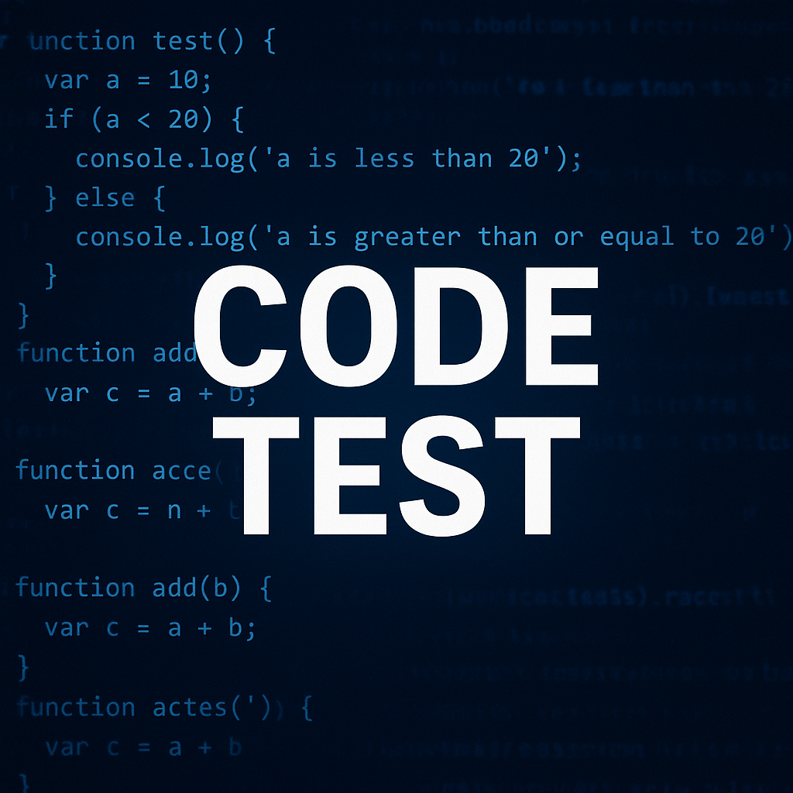

{width="50%"}

## 알고리즘 & 자료구조

### Python 필수 도구

1. [Python 내장 함수·자료구조 레퍼런스 (Level 1~2)](./algorithm/python_builtins_level1-2_reference.qmd)

### 문자열(String)

1. [문자열 내림차순 정렬 (Level 1)](./algorithm/string_level1_problems.qmd)

### 해시(Hash)

1. [포켓몬 (Level 1)](./algorithm/hash_level1_pocketmon.qmd)
2. [완주하지 못한 선수 (Level 1)](./algorithm/hash_level1_runner.qmd)
3. [전화번호 목록 (Level 2)](./algorithm/hash_level2_phone_number.qmd)

### 데이터 조작(Data Manipulation)

1. [데이터 조작 문제 모음 (Level 1~5, DS)](./algorithm/data_manipulation_level1-5_problems.qmd)

### 정렬(Sorting)

1. [정렬 문제 모음 (Level 1, DS)](./algorithm/sorting_level1_problems.qmd)

## SQL

### SELECT

1. [SELECT 문제 모음 (Level 1)](./sql/select_level1_problems.qmd)
