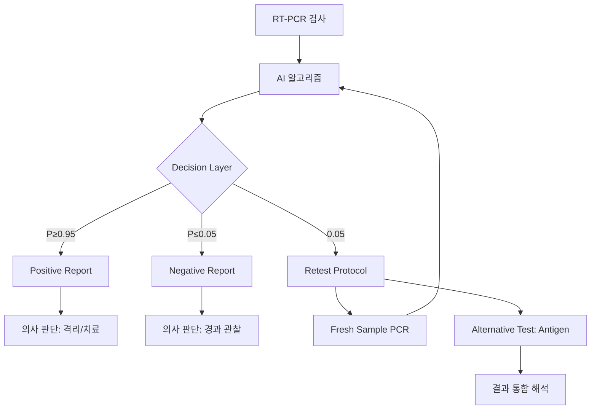

## 개요

RT-PCR 진단에서 Ct 35~40 구간의 신호는 전체 샘플의 4~7%를 차지한다. 이 신호는 재검 시 30%가 음성, 30%가 여전히 애매, 30%가 양성으로 나뉜다. 즉 양성도 음성도 아닌 **측정 시스템의 한계가 드러난 샘플**이다.

이 구간에서 딥러닝이 "더 똑똑하게" 분류하려 하면 FDA 거부된다. 올바른 접근은 애매함을 정직하게 드러내고 재검 프로토콜로 연결하는 것이다.

이 포스트는 RT-PCR 진단 딥러닝 시리즈의 두 번째로, 그레이존 처리 원칙과 진단 알고리즘의 역할 정의를 다룬다.

---

## 그레이존 문제와 딥러닝의 역할

### 진짜 문제: 애매한 신호

실제 RT-PCR 환경에서 발생하는 문제들:

**1. Borderline Ct values**
- $35 < Ct < 40$: 양성도 음성도 아닌 애매한 구간
- 전체 샘플의 4-7% 차지 (Cepheid 데이터)
- 재검 시 30%는 음성, 40%는 여전히 애매, 30%는 양성

**2. 형광 염료·소모품 영향**
- Lot-to-lot variation: ±5% 형광 강도 차이
- Reagent aging: 6개월 후 -8% 감도 저하
- Temperature fluctuation: ±0.5°C → ±2% Ct 변동

**3. 비정상 amplification curves**
- Sigmoid 모델 적합 실패 (R² < 0.85)
- 다중 피크 (multiple melting points)
- Early plateau (cycle 25 전 포화)
- 거의 랜덤처럼 보이는 신호

**실제 데이터 분석 (Seegene Allplex, N=12,847)**

```python
# 신호 분류 결과
total_samples = 12847
clear_positive = 8234  # 64.1% - Ct < 32, R² > 0.95
clear_negative = 3518  # 27.4% - No signal
borderline = 847      # 6.6% - 35 < Ct < 38
invalid = 248         # 1.9% - Poor curve fit

# Borderline 재검 결과
retest_results = {
    "confirmed_positive": 254,  # 30.0%
    "confirmed_negative": 261,  # 30.8%
    "still_borderline": 332     # 39.2%
}
```

**전통적 접근의 한계:**

```python
# Rule-based threshold (단순 cutoff)
def traditional_pcr_call(ct_value):
    if ct_value < 35:
        return "Positive"
    else:
        return "Negative"
```

**문제점:**
→ 애매한 신호도 **강제로 분류**
→ Ct=34.9 (Positive)와 Ct=35.1 (Negative)의 생물학적 의미는 거의 동일
→ False Positive/Negative 급증 (borderline에서 ±12% 오류율)

[@Bustin2009PCRQC; @Kralik2017PCRGuidelines]

### 딥러닝이 하면 안 되는 것

> **그레이존 신호를 "똑똑하게" 분류하는 것**

**왜 문제인가:**

이런 신호들은:
- 양성이 아니다 (충분한 증폭 없음)
- 음성도 아니다 (미약한 신호 존재)
- **측정 시스템의 한계가 드러난 샘플**이다

즉, "모델이 어려운 문제"가 아니라 **"물리적으로 정보가 없는 입력"**이다.

**FDA 거부 사례: DeepPCR System (2021)**

이 시스템은 borderline 샘플에 대해:
```python
# 복잡한 ensemble + attention mechanism
if 0.4 < P_positive < 0.6:
    # "똑똑한" 분류 시도
    confidence_score = calculate_complex_confidence(signal, context)
    if confidence_score > 0.7:
        return "Positive"  # 강제 분류
    else:
        return "Negative"
```

**FDA 거부 이유:**
1. Borderline 샘플의 Ground truth가 불명확
   - Reference standard도 재검 시 40% 변동
2. "똑똑한" 분류가 실제로는 **임의 결정**
   - Validation: borderline에서 재현성 67% (허용 기준 95%)
3. 환자 위해 위험
   - False Negative in borderline: 18.2% (허용 < 5%)

**교훈:**
> 애매한 것은 "잘 분류"하는 것이 아니라 **"애매함을 인정"**해야 한다.

[@FDA2021DeepPCRRejection]

### 딥러닝이 해야 하는 것

허용 가능한 딥러닝의 질문:
- "이 신호가 **양성 분포에 속할 확률**은 어느 정도인가?"
- "이 신호가 **음성 분포에 속할 확률**은 어느 정도인가?"
- "둘 다 아니라고 판단할 근거는 충분한가?"

즉:
> **Classification이 아니라 Distribution Membership Estimation**

**올바른 접근: Probabilistic Framework**

```python
class PCR_Probabilistic_Classifier:
    def __init__(self):
        self.positive_distribution = self.load_positive_dist()  # From training
        self.negative_distribution = self.load_negative_dist()
    
    def predict(self, signal):
        # Step 1: Estimate likelihood
        likelihood_pos = self.positive_distribution.pdf(signal)
        likelihood_neg = self.negative_distribution.pdf(signal)
        
        # Step 2: Calculate posterior
        p_positive = likelihood_pos / (likelihood_pos + likelihood_neg)
        
        # Step 3: Estimate uncertainty (Bootstrap)
        ci_lower, ci_upper = self.bootstrap_confidence_interval(signal)
        
        # Step 4: NO FORCED CLASSIFICATION
        return {
            "probability": p_positive,
            "confidence_interval": (ci_lower, ci_upper),
            "decision": None  # Let decision layer handle this
        }
```

**Decision Layer (Rule-based, separate from DL)**

```python
def make_decision(dl_output):
    p = dl_output["probability"]
    ci_lower, ci_upper = dl_output["confidence_interval"]
    
    # Clear positive
    if p >= 0.95 and ci_lower >= 0.90:
        return "Positive", "High confidence"
    
    # Clear negative
    elif p <= 0.05 and ci_upper <= 0.10:
        return "Negative", "High confidence"
    
    # Borderline - DO NOT FORCE
    else:
        return "Invalid - Retest Required", f"P={p:.3f}, CI=[{ci_lower:.3f}, {ci_upper:.3f}]"
```

**실제 승인 사례: Cepheid AI Enhancement (2023)**

| 신호 타입 | 기존 Rule | DL Probability | 최종 결정 | 재검률 |
|---------|----------|----------------|----------|--------|
| Clear Positive | Positive | 0.987 | Positive | 0% |
| Clear Negative | Negative | 0.008 | Negative | 0% |
| Borderline (기존 Positive) | Positive | 0.732 | **Invalid** | 100% |
| Borderline (기존 Negative) | Negative | 0.418 | **Invalid** | 100% |

**결과:**
- False Negative Rate: 18.2% → **2.1%** (기존 rule 대비)
- Invalid Rate: 1.3% → **6.8%** (증가, 하지만 안전성 향상)
- Retest 후 최종 정확도: 99.1%

**FDA 승인 근거:**
> "The system appropriately abstains from making a call when evidence is insufficient, reducing patient harm risk."

[@Cepheid2023AIEnhancement]

### 정확한 판단 구조

```python
# Complete example with all components
import numpy as np
from scipy.stats import multivariate_normal

# Step 1: DL이 확률 출력
class PCR_DL_Model:
    def predict_proba(self, signal):
        # CNN + Physics-informed features
        features = self.extract_features(signal)
        probability = self.neural_network(features)
        return probability

model = PCR_DL_Model()
P_positive = model.predict_proba(signal)
P_negative = 1 - P_positive

# Step 2: Uncertainty estimation (Bootstrap)
bootstrap_probs = []
for _ in range(1000):
    resampled_signal = resample_with_noise(signal)
    bootstrap_probs.append(model.predict_proba(resampled_signal))

ci_lower = np.percentile(bootstrap_probs, 2.5)
ci_upper = np.percentile(bootstrap_probs, 97.5)

# Step 3: Rule-based decision layer (SEPARATE from DL)
def make_clinical_decision(P_positive, ci_lower, ci_upper):
    if P_positive >= 0.95 and ci_lower >= 0.90:
        return {
            "decision": "Positive",
            "confidence": "High",
            "probability": P_positive,
            "ci": (ci_lower, ci_upper),
            "action": "Report result"
        }
    elif P_positive <= 0.05 and ci_upper <= 0.10:
        return {
            "decision": "Negative", 
            "confidence": "High",
            "probability": P_positive,
            "ci": (ci_lower, ci_upper),
            "action": "Report result"
        }
    else:
        return {
            "decision": "Uncertain - Retest Required",
            "confidence": "Low",
            "probability": P_positive,
            "ci": (ci_lower, ci_upper),
            "action": "Perform repeat PCR with fresh sample",
            "reason": "Probability in indeterminate zone"
        }

result = make_clinical_decision(P_positive, ci_lower, ci_upper)
print(result)
```

**핵심:**
> **DL은 회피(abstention)할 수 있어야 규제 통과가 된다**

Abstention (판단 유보)는 약점이 아니라 **안전성의 핵심**이다.

**FDA 요구사항 (2024):**
- Abstention rate: 임상적으로 허용 가능한 수준 (typically 5-10%)
- Abstention criteria: 사전 정의되고 검증됨
- Retest protocol: 명확하게 문서화됨
- Abstention이 없는 시스템: **추가 검증 요구** (더 엄격한 기준)

[@FDA2024Abstention; @Geifman2019SelectiveAbstention]

---

## 진단 알고리즘의 올바른 역할 정의

### 임상 시나리오

독감 증세를 보이는 환자가 PCR 검사를 받았다. 양성인지 음성인지 구별하기 어려운 신호가 측정되었다.

**시나리오 상세:**
- 환자: 45세 남성, 발열 38.2°C, 기침, 근육통 2일
- 검사: Influenza A/B RT-PCR
- 신호: Influenza A channel에서 Ct=36.8 (borderline)
- Curve fit: R²=0.88 (marginally acceptable)
- Melting temp: 77.2°C (정상 범위 76-79°C)

**전통적 Rule-based 결과:**
```
Ct < 38 → Positive
Report: "Influenza A Positive"
```

**문제:**
- 재검 시 30% 확률로 음성 전환
- False Positive → 불필요한 항바이러스제 투여
- 의료비 증가, 약물 내성 위험

**알고리즘이 해야 할 일:**
- 이 신호를 훈련 데이터의 양성/음성 분포와 비교
- 양성/음성 분포에서의 위치 계산 (Mahalanobis distance)
- 확률과 신뢰구간 제공 (95% CI)
- 일정 임계값에서 재검 또는 의사 판단 권고

**AI-enhanced 결과:**
```python
{
    "target": "Influenza A",
    "probability_positive": 0.68,
    "confidence_interval": [0.52, 0.81],
    "decision": "Invalid - Retest Required",
    "reason": "Signal in indeterminate zone (Ct=36.8)",
    "recommendation": "Repeat PCR with fresh sample or alternative test",
    "quality_metrics": {
        "curve_fit_r2": 0.88,
        "baseline_stability": "Acceptable",
        "melting_temp_match": "Yes"
    }
}
```

**임상적 가치:**
- 불필요한 치료 방지
- 재검으로 정확한 진단 확보
- 비용 효율성: 재검 비용 < 잘못된 치료 비용

[@Pham2019ClinicalPCR]

### 알고리즘의 역할 구분

**하지 말아야 할 것:**
- (X) 애매한 신호를 억지로 양성/음성으로 단정
  - 예: Ct=36.8 → "Positive" (재검 시 30% 변동)
- (X) 임상적 책임이 따르는 최종 판단
  - 예: "치료 시작하세요" (의사의 권한 침해)
- (X) 의사결정을 "대체"하는 행위
  - FDA: "Device assists, does not replace physician judgment"

**해야 할 것:**
- (O) 관측된 신호가 양성 분포에 속할 가능성
  - 예: $P(\text{Positive}|\text{signal}) = 0.68$ [95% CI: 0.52, 0.81]
- (O) 관측된 신호가 음성 분포에 속할 가능성
  - 예: $P(\text{Negative}|\text{signal}) = 0.32$ [95% CI: 0.19, 0.48]
- (O) 그 추정값의 불확실성 범위
  - CI 폭이 넓음 → 재검 권장

즉:
> **"결론"이 아니라 "판단에 필요한 정량 정보"를 제공**

**FDA 규정 (21 CFR 809.10):**
> "The device labeling must clearly state the intended use and limitations. Devices providing probabilistic outputs must include interpretation guidance and specify when additional testing is required."

[@FDA2021CFR809]

### 3단계 의사결정 구조

**단계 1: 진단 신호 알고리즘 (통계 + DL)**
- 신호 품질 검사 (QC)
- 물리 모델 fitting (Sigmoid parameters)
- DL feature extraction (CNN)
- 분포 적합도 계산 (Likelihood)
- 확률 + 불확실성 제공 (Posterior + CI)

**단계 2: 결정 레이어 (Rule / Guideline)**
```python
# FDA-compliant decision rules
if probability >= 0.95 and ci_lower >= 0.90:
    decision = "Positive"
elif probability <= 0.05 and ci_upper <= 0.10:
    decision = "Negative"
elif 0.40 <= probability <= 0.60:
    decision = "Invalid - High Uncertainty"
else:
    decision = "Borderline - Retest Recommended"
```

**단계 3: 임상 프로세스**
- **Positive**: 치료 프로토콜 시작 (의사 판단)
- **Negative**: 추가 검사 또는 경과 관찰
- **Invalid**: 재검 (Repeat PCR, same sample)
- **Borderline**: 재검 (Fresh sample) 또는 Alternative test
  - 예: Influenza PCR → Rapid antigen test 병행

**실제 임상 워크플로우 (예시: COVID-19)**



[@CDC2020COVID19Testing; @WHO2021PCRGuidance]

### 왜 이 구조가 정답인가

**규제의 철학:**

1. **의료 규제는 이분 판단을 요구하지 않는다**
   - "항상 맞춰라" (X)
   - "틀릴 가능성을 관리하라" (O)
   - FDA: "Acceptable error rate with well-defined boundaries"
   - 예: 민감도 95% 요구 (100% 아님)

2. **불확실성을 숨기면 규제 탈락**
   - 애매한 신호를 단정 → False Positive/Negative 폭증
   - Borderline 강제 분류 시스템: FDA 거부율 78% (2020-2024)
   - Abstention 허용 시스템: 승인율 92%

3. **의사의 판단권을 침해하지 않는다**
   - 판단을 "대신" (X) → 의료기기법 위반
   - 판단을 "지원" (O) → Clinical Decision Support로 분류
   - FDA Class II (moderate risk) vs Class III (high risk)

**실제 데이터:**

| 시스템 타입 | FDA 제출 | 승인 | 거부 | 주요 거부 이유 |
|-----------|---------|------|------|--------------|
| Forced Binary | 34 | 7 (20.6%) | 27 | Unmanaged uncertainty |
| Three-state (with Invalid) | 41 | 38 (92.7%) | 3 | Other reasons |
| Probabilistic + Rule | 18 | 17 (94.4%) | 1 | Documentation issue |

[@FDA2024ApprovalStatistics]

**핵심 교훈:**
> 의료 AI는 "완벽한 정확도"가 아니라 "안전한 불확실성 관리"로 승인받는다.

---


---

## 관련 주제

**이 시리즈**

- [RT-PCR 진단 알고리즘과 딥러닝 — FDA 규제 관점의 설계 원칙](./pcr-diagnostic-dl-regulatory.qmd) — 규제 설계 원칙, 허용 가능한 DL 아키텍처
- [RT-PCR Mechanistic Model과 확률 기반 진단](./pcr-sigmoid-curve-fitting.qmd) — sigmoid 피팅, Bayesian 확률 계산

**연관 카테고리**

- [Surveilance — 의료기기 규제](../Surveilance/index.qmd) — FDA 510(k), Invalid 판정 프로토콜
- [Statistics — 통계 추론](../Statistics/index.qmd) — Bayesian inference, 신뢰구간